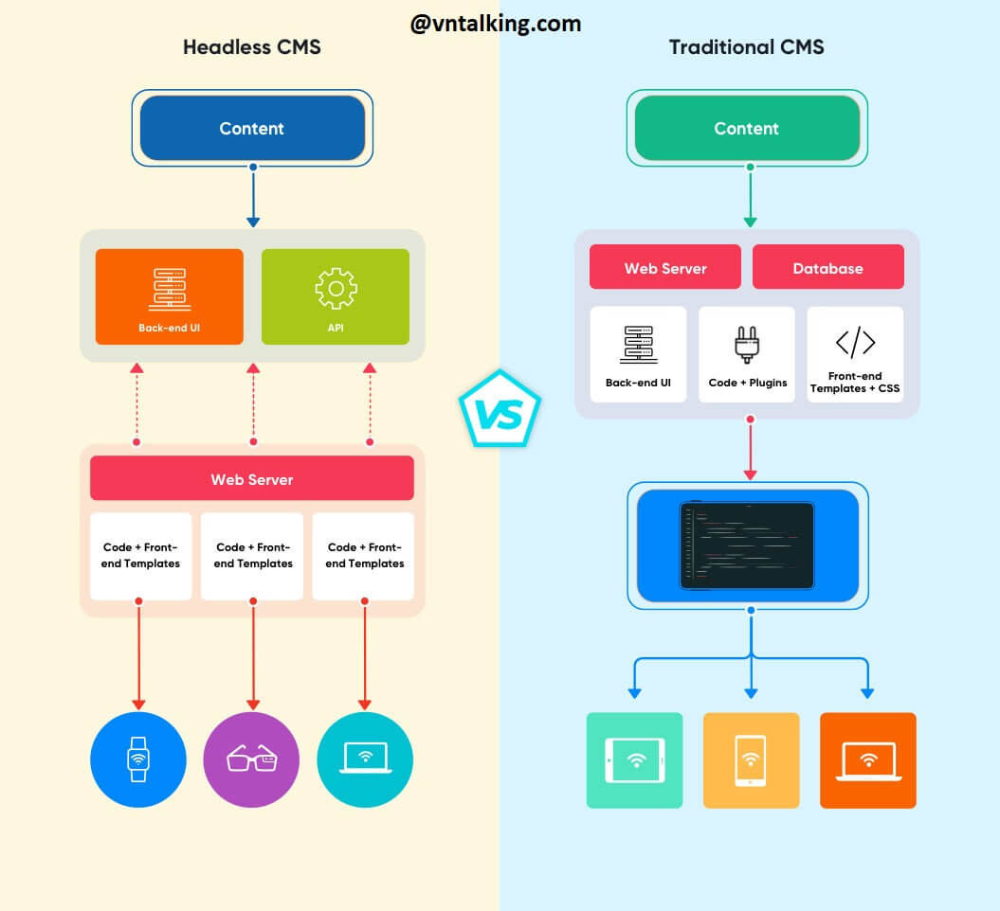
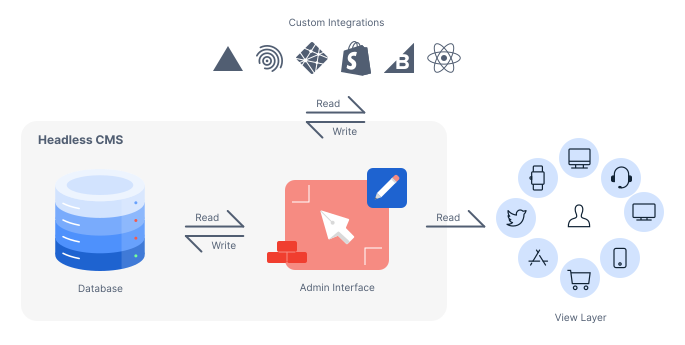

# I. Introduction to Headless CMS

## 1. What is a Headless CMS?
- A headless CMS is a content management system that separates the backend (where content is created and stored) from the frontend (the presentation layer where content is displayed). Instead of a single, built-in frontend, it uses APIs to deliver content to any device or platform, such as websites, mobile apps, smart devices, and digital signage.

## 2. Comparison: Headless CMS vs Traditional (Coupled/Decoupled CMS)

| Criteria | Coupled CMS (Monolithic) | Decoupled CMS | Headless CMS (API-first) |
| :--- | :--- | :--- | :--- |
| **Architecture** | Tightly Coupled. Backend (management) and Frontend (display) are a single, unified system. | Decoupled. Backend and Frontend are separate, but the Backend is still "aware" of the Frontend. | Fully Decoupled. The Backend has no concept of the Frontend. |
| **Frontend (Interface)**| Built-in. Usually a proprietary theme/template system. | Still has a default Frontend (often the traditional "head"), but also provides an API for other "heads". | **No Frontend**. Only provides an API. The interface must be 100% custom-built. |
| **Content Delivery** | **Push:** The CMS pushes content directly into templates/themes to render HTML. | **Push & Pull:** Both pushes content to the default Frontend and allows other Frontends to pull via API. | **Pull:** Content can only be retrieved (pulled) via API calls from any Frontend. |
| **Frontend Flexibility**| Very Low. Bound to the CMS's technology (e.g., PHP in WordPress). | Medium. Can customize the default Frontend or build a new one via API. | Very High. Complete freedom to choose any technology (React, Vue, Svelte, iOS, Android...). |
| **Content Preview** | Very Strong. Live Preview (WYSIWYG) features are often deeply integrated. | Good. Can usually preview on the default Frontend. | None by default. Must be custom-built by developers (custom preview). |
| **Workflow** | Page-centric. Users create complete "pages". | Hybrid between "Page" and "Content". | Content-first. Users create structured blocks of content. |
| **Omnichannel** | Very Poor. Very difficult to get content onto platforms other than the website. | Possible. Can use the API to deliver content to mobile, apps. | Ideal. This is the main purpose; easily distribute one content source to many channels. |
| **Examples** | WordPress (default setup), Joomla, Drupal (default setup). | WordPress (using REST API), Drupal (with JSON:API module activated). | Strapi, Contentful, Sanity.io, Payload CMS, Directus, Ghost (Headless mode). |

## 3. Key Advantages
Key advantages of a headless CMS include greater flexibility for developers, enhanced performance and speed, and the ability to deliver content across multiple platforms (omnichannel). Developers can use their preferred frameworks, content can be reused on websites, mobile apps, and IoT devices, and the decoupled nature improves security and scalability


**Flexibility and developer freedom**

- Choice of front-end: Developers are not tied to a specific template or framework and can use any programming language or technology they prefer for the presentation layer.
- Streamlined development: The separation of content management (backend) from design (frontend) allows for separate workflows, making development and updates more efficient.
- Faster development: Because developers can use modern frameworks and are not limited by a proprietary platform, they can build and iterate on the front-end faster. 


**Performance and scalability**

- Faster loading times: Websites and apps perform faster because content is delivered via API, and the architecture often leverages faster front-end technologies and CDNs.
- Increased scalability: The decoupled architecture is more scalable and can better handle high traffic periods by separating the presentation from the content repository.


**Omnichannel content delivery**

- Deliver to any device: Content is stored in a central repository and can be delivered to any device or platform, such as websites, mobile apps, smartwatches, and other IoT devices.

- Content reusability: A single piece of content can be published across multiple channels without being reformatted or duplicated, saving time and effor.


**Security and future-proofing**

- Enhanced security: By decoupling the backend (content) from the frontend (presentation), the CMS database is not directly exposed to the internet, which can reduce vulnerabilities.
- Future-proof: A headless CMS is designed to be adaptable, allowing you to easily integrate new technologies and channels as they emerge without overhauling the entire system.
---

# II. Common Use Cases of Headless CMS

## 1. Websites, Blogs, Landing Pages
A headless CMS is ideal for modern web development. Because the content (backend) is completely separate from the presentation (frontend), developers are free to use **any modern framework** they prefer, such as React, Vue, Svelte, or Angular.

This approach allows for building highly optimized, fast-loading websites. Teams can leverage **Static Site Generation (SSG)** or **Server-Side Rendering (SSR)** to create exceptional user experiences and improve SEO. Marketing teams can still manage all content (like blog posts, author bios, and landing page copy) in a user-friendly interface, while developers focus on building the best possible frontend without being restricted by a traditional CMS theme.

## 2. Mobile and IoT Applications
This is where the "content as data" approach of a headless CMS truly shines. Since all content is delivered via an **API** (typically REST or GraphQL), it can be consumed by any platform, not just a web browser.

A single CMS can power:
* **Native Mobile Apps:** An iOS or Android app can fetch articles, product information, or user guides directly from the same content repository that the main website uses.
* **IoT Devices:** Content can be displayed on smartwatches, digital signage in a store, smart-TV apps, or even delivered through voice assistants (like Alexa or Google Assistant).

This eliminates the need for separate content silos for each application, ensuring consistency and simplifying updates.

## 3. Omnichannel Content Delivery
This use case is the natural extension of the first two. "Omnichannel" refers to providing a seamless and consistent brand experience across **all possible customer touchpoints**. A headless CMS is the central engine for this strategy.

It provides a **single source of truth** for all structured content. A marketing team can create or update a piece of content (like a new product promotion or an important announcement) *once* in the CMS. That single update is then automatically published everywhere:

* The company's main website.
* The e-commerce store.
* The native mobile app.
* In-store digital kiosks.
* Email marketing campaigns.
* Partner portals or third-party marketplaces.

This ensures **brand consistency** and **operational efficiency**, as there's no need to manually copy and paste content between different systems, which dramatically reduces the risk of errors and outdated information.

---

# III. Architecture and Workflow of Headless CMS


---

# IV. Headless CMS Demo

## 1. Strapi 
- version: 5.29.0
## 2. Demo Steps
```bash
    npx create-strapi-app gold-cms --quickstart
```

# V. Self-Hosted Headless CMS Deployment


# VI. Connecting Frontend to Headless CMS

1. Fetching Data via RESTful API


2. Displaying Content on Website or App

(Show a simple example of rendering data)

# VII. Evaluation and Conclusion
1. Strengths and Weaknesses of Headless CMS


2. Recommendations for Real Projects

(Short recommendations...)