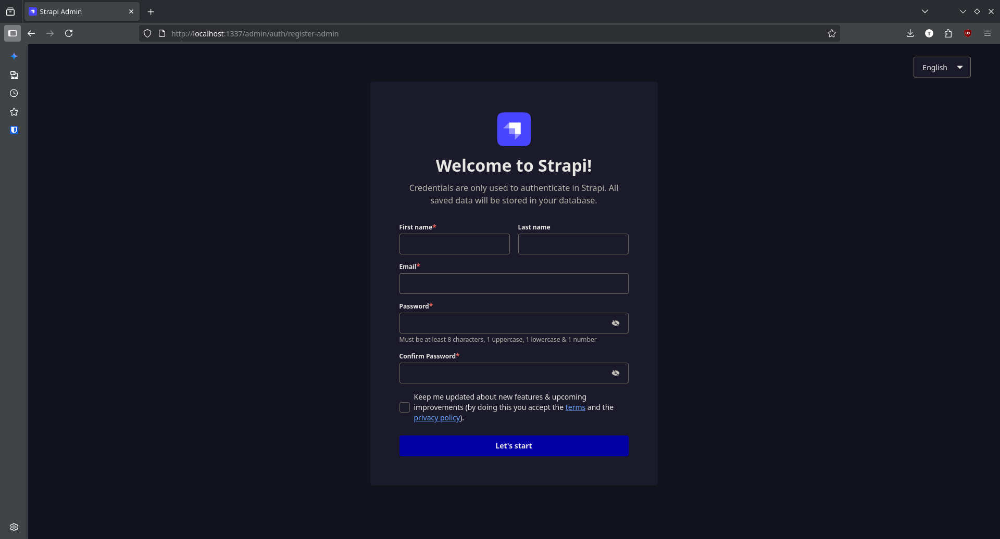
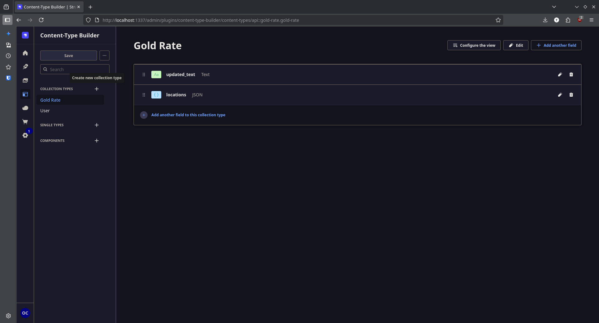
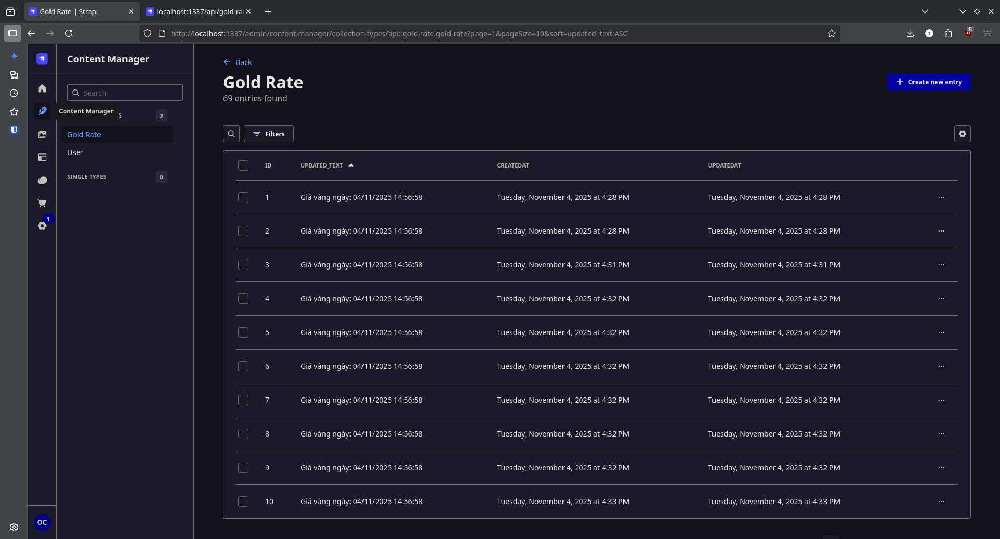
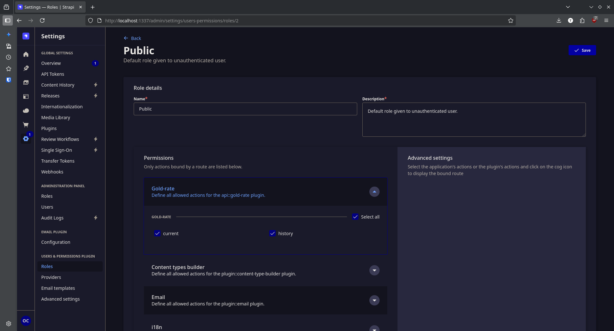
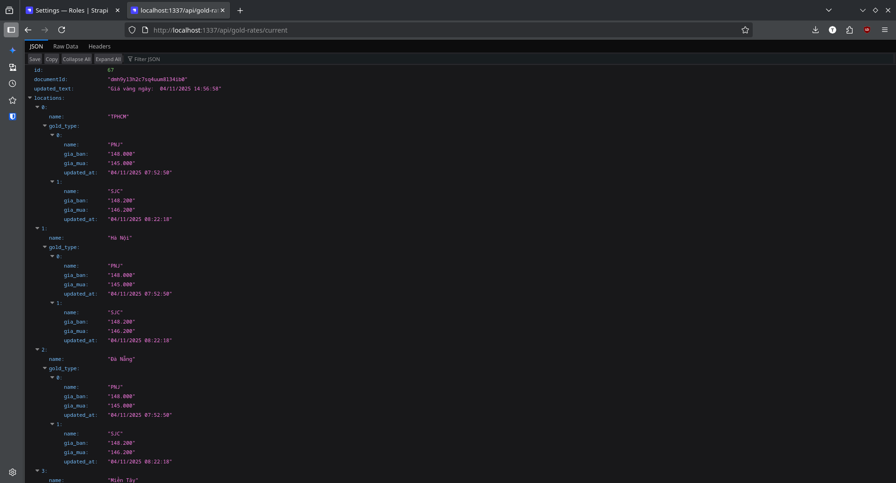

# Strapi Demo Setup — Simple Guide

This guide explains the steps to run the Strapi backend used in the demo and to expose a public API endpoint for the frontend.

Prerequisites
- Node.js and npm installed
- Project already initialized (Strapi project files present)

Steps

1. Start Strapi in development mode
- In the project root run:
  ```
  npm run develop
  ```
- Strapi admin will be available at: http://localhost:1337/admin
- 

2. Create an admin account
- Open the admin URL in your browser and register an admin user.
- Log in after registration.

3. Create content types (entities)
- Go to "Content-Type Builder".
- Create a new content type (for example: `gold-rate` or `gold-rates`) and add the necessary fields (e.g., date, buyPrice, sellPrice, source).
- Save the content type and let Strapi restart if needed.
- 

4. Add sample data
- Open "Content Manager".
- Select your new content type and add several sample entries to test the API.
- 

5. Implement controllers (if custom logic is needed)
- Custom controllers live under: `src/api/<content-type>/controllers/`
- Create or edit the controller file to return the data your frontend needs (for example `current` rate).
- Example path:
  ```
  src/api/gold-rate/controllers/gold-rate.js
  ```

6. Make the API public
- Go to "Settings" → "Roles" → "Public".
- Find the permissions for your content type (e.g., `gold-rates`) and enable the actions you want public (e.g., `find`, `findOne`, or a custom `current` action).
- Save the role.
- 

7. Test the API
- Open the endpoint in your browser or use curl:
  ```
  http://localhost:1337/api/gold-rates/current
  ```
  or
  ```
  curl http://localhost:1337/api/gold-rates/current
  ```
- You should get a JSON response with the expected data.
- 

8. Automate fetching PNJ gold price and saving to Strapi
- Goal: fetch data from PNJ API `https://edge-api.pnj.io/ecom-frontend/v3/get-gold-price` and save it to the `gold-rate` content type using Strapi query API, for example:
  ```
  strapi.db.query("api::gold-rate.gold-rate").create({ data });
  ```
- Steps:
  1. Write a small service that calls the PNJ endpoint, maps the response to your fields, and creates (or updates) a `gold-rate` record.
  2. Register a cron task that calls the service on a schedule.
  3. Ensure the cron configuration is enabled so Strapi runs the task.

That’s all — the backend is now public, automated to fetch gold prices, and ready for the frontend to consume.