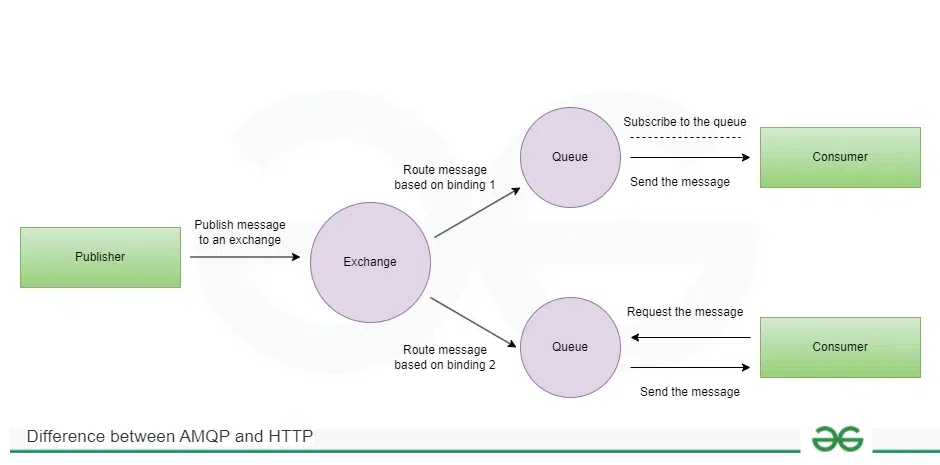

# Service Integration - Week 7

## Table of Contents
- [Part 1: Service Integration Overview](#part-1-service-integration-overview)
- [Part 2: gRPC - Synchronous Communication](#part-2-grpc---synchronous-communication)
- [Part 3: Message Broker - Asynchronous Communication](#part-3-message-broker---asynchronous-communication)
- [Part 4: RabbitMQ](#part-4-rabbitmq)
- [Part 5: Apache Kafka](#part-5-apache-kafka)
- [Part 6: Comparing gRPC vs Message Broker](#part-6-comparing-grpc-vs-message-broker)
- [Part 7: Comparing RabbitMQ vs Kafka](#part-7-comparing-rabbitmq-vs-kafka)
- [Part 8: When to Use Each Technology?](#part-8-when-to-use-each-technology)
- [Part 9: Hybrid Architecture](#part-9-hybrid-architecture)
- [Part 10: Demo & Practice](#part-10-demo--practice)
- [Practice Exercises](#practice-exercises)
- [References](#references)
- [Discussion Questions](#discussion-questions)

---

## Part 1: Service Integration Overview

### 1.1. What is Service Integration?

Microservices architecture was created to overcome the limitations of large monolithic applications — mainly issues with scalability, deployment speed, and tight coupling.
By dividing a big system into smaller, independent services, teams can scale parts individually, deploy faster, and work more autonomously.

Service integration refers to the process of connecting and coordinating different services—often in a microservices, SOA (Service-Oriented Architecture), or enterprise system—so they can communicate and work together seamlessly.

### 1.2. Integration Methods

#### 1. Synchronous Communication

Synchronous communication happens when two services interact in real time — the caller sends a request and waits for a response before proceeding.

Method:

- HTTP

- gRPC 

- GraphQL

- SOAP

When to Use Synchronous Communication?

- You need immediate feedback (e.g., validation, authentication, payment confirmation).

- Operations are short-lived (milliseconds to seconds).

- Strong consistency or sequential workflow is required.

- The system can tolerate tight coupling for that specific operation.

Why use synchronous communication?
- Simplicity – Easy to implement and reason about.

- Immediate response – Client knows success or failure right away.

- Strong consistency – State changes can be validated and committed in one flow.

- Ease of debugging – You can test endpoints directly via Postman or curl.
#### 2. Asynchronous Communication

Asynchronous communication is a pattern where services exchange messages without waiting for an immediate response. The sender posts a message and continues; the receiver processes the message later. This decouples timing and availability between services and is a core pattern in resilient, scalable distributed systems.

Method:

- Message queue

- Publish - subscribe

- Work queue with competing consumers

- Event streaming


Why use asynchronous communication?

- Loose coupling: Sender and receiver don’t have to be up at the same time.

- Scalability: Work can be buffered in queues and processed by many consumers.

- Resilience: Temporary failures of consumers don’t block producers. Messages persist until processed.

- Throughput: Producers can push messages rapidly; consumers handle them at their own pace.

- Event-driven design: Naturally supports event-driven architectures, CQRS, and event sourcing.
---

## Part 2: gRPC - Synchronous Communication

### 2.1. What is gRPC?

**gRPC** is a high-performance, open-source framework for remote procedure calls (RPC) that allows client and server applications to communicate transparently and efficiently. It uses HTTP/2 for transport, Protocol Buffers to define service and message structures.

### 2.2. gRPC Architecture


- Protobuf: interface definition language (IDL) and serialization format. 
- gRPC client: sends requests to the server as if calling a local method.
- gRPC server: implements the service interface defined in .proto, exposes endpoints that clients can call remotely, can handle multiple concurrent RPC calls efficiently.
- Transport layer: use HTTP/2
    + Multiplexing: Multiple requests/responses over a single connection

    + Bi-directional streaming: Both client and server can send data simultaneously

    + Header compression: Reduces network overhead

    + Server push: Useful for streaming responses
### 2.3. Protocol Buffers

Protocol Buffers (Protobuf) is a language-neutral, platform-neutral, and extensible way of serializing structured data.
It was developed by Google as a faster, smaller alternative to XML or JSON for communication between services or for data storage.

- Compact binary format

- Language-neutral

- Platform-neutral 

- Strongly typed

- Versioning

### 2.4. Types of gRPC Calls

#### 1. Unary RPC

The client sends a single request message to the server, and the server responds with a single response message.

**How it works:**
- Client calls a remote method with one request.
- Server processes the request and sends back one response.

**Benefits:**
- Simple and easy to implement.
- Suitable for standard request/response operations.
- Strongly typed and compile-time verified.

#### 2. Server Streaming

The client sends a single request message to the server, and the server responds with a stream of messages. The client reads from this stream until all messages have been received

**How it works:**
- Client sends a single request.
- Server sends multiple responses as a stream.
- Client reads each message asynchronously as they arrive.

**Benefits:**
- Efficient for sending large amounts of data incrementally.
- Reduces memory usage (no need to wait for all data at once).
- Useful for real-time updates or large datasets.


#### 3. Client Streaming

The client sends a stream of messages to the server, and after all messages are sent, the server responds with a single response message

**How it works:**
- Client streams multiple messages.
- Server processes messages as they arrive.
- Server sends one final response when client completes streaming.

**Benefits:**
- Good for uploading large datasets in chunks.
- Reduces network congestion and memory usage.
- Supports asynchronous and incremental processing.

#### 4. Bidirectional Streaming

This allows both the client and the server to send and receive streams of messages independently

**How it works:**
- Client and server establish a stream.
- Both sides can send messages independently and asynchronously.
- Useful for real-time applications where both sides need to communicate continuously.

**Benefits:**
- Real-time two-way communication.
- Low-latency, ideal for chat, gaming, telemetry, or live updates.
- Supports back-and-forth asynchronous messaging.

### 2.5. Advantages of gRPC

- Performance and Efficiency
    + **HTTP/2:** Enables multiplexing, header compression, and server push for faster data transfer.  
    + **Protocol Buffers:** Uses compact binary serialization, reducing bandwidth and improving speed.  
    + **Compression:** Supports message compression to further reduce network usage.  

- Strong Typing and Code Generation
    + **Code generation:** Automatically generates client/server code from `.proto` files, saving development time.  
    + **Strongly-typed contracts:** Ensures data consistency and catches errors at compile-time.  

- Communication and Flexibility
    + **Bidirectional streaming:** Supports real-time, two-way messaging for applications like chat or live updates.  
    + **Polyglot support:** Works with many programming languages, enabling interoperability in diverse environments.  
    + **Pluggable features:** Middleware (interceptors) allow integration of load balancing, authentication, tracing, and health checks.  

- Scalability
    + **High throughput:** Low latency, efficient communication for microservices.  
    + **Easily scalable:** Can handle high traffic volumes and many concurrent connections.  

### 2.6. Disadvantages of gRPC

- **Steeper Learning Curve:** Requires learning Protocol Buffers (Protobuf), unlike familiar JSON or XML in REST.  
- **Limited Browser Support:** Browsers don’t natively support gRPC over HTTP/2; workarounds like gRPC-Web are needed.  
- **Smaller Ecosystem:** Fewer tools, libraries, and community resources compared to REST.  
- **Debugging Challenges:** Binary data is harder to inspect and debug than human-readable formats.  
- **HTTP/2 Dependency:** Requires environments that fully support HTTP/2.  
- **Complex Error Handling:** Does not use standard HTTP status codes; custom error handling is needed.

---

## Part 3: Message Broker - Asynchronous Communication

### 3.1. What is Message Broker?

A message broker is a software system that enables communication between different applications or services by receiving, storing, and forwarding messages. It acts as an intermediary, allowing systems to exchange information without being directly connected or dependent on each other.

### 3.2. Basic Concepts



#### 1. Producer

Service that send message to exchange

#### 2. Consumer

Service that receive message, can run in parallel for scaling

#### 3. Queue

Store message until consumed, configurable (durable, exclusive, auto-delete, TTL, dead-letter)

#### 4. Topic

Routing mechanism based on pattern matching (used in topic exchanges)

#### 5. Exchange

Receives messages from producers and routes them to one or more queues according to rules

#### 6. Partition

A way to split data across multiple brokers or nodes for parallel processing and scalability (common in Kafka)

---

## Part 4: RabbitMQ

### 4.1. RabbitMQ Overview

Message broker, asynchronous messaging, base on AMQP but support MQTT, HTTP, STOMP,...

### 4.2. RabbitMQ Architecture

#### Exchange Types:

##### 1. Direct

Exact routing key match

##### 2. Fanout

Broad cast to all bound queues

##### 3. Topic

Routing based on pattern

##### 4. Headers

Routing based on message header

### 4.3. Messaging Patterns with RabbitMQ

#### 1. Work Queue Pattern

Distribute time-consuming tasks among multiple workers to balance load.

How it works:

- Producers send messages (tasks) to a queue.

- Multiple consumers (workers) listen to the queue.

- Each message is delivered to one consumer only.

- Helps scale processing and avoid overloading a single worker.

#### 2. Publish/Subscribe Pattern

Send the same message to multiple consumers.

How it works:

- Producer sends a message to an exchange (fanout type).

- Exchange broadcasts the message to all bound queues.

- Every consumer listening on its queue gets a copy.

#### 3. Routing Pattern

Send messages to specific queues based on a routing key.

How it works:

- Producer sends messages to a direct exchange with a routing key.

- Exchange sends message to queues that are bound with the matching key.

#### 4. RPC Pattern

Implement synchronous request/reply messaging using RabbitMQ.

How it works:

- Client sends a request message to a queue.

- Server (consumer) processes the message and sends back a reply to a queue specified by the client.

- The client waits for the response before continuing.

### 4.4. RabbitMQ Advantages

- Reliable Messaging

+ Supports message acknowledgment, ensuring messages aren’t lost.

+ Can persist messages to disk so they survive broker restarts.

- Flexible Routing

+ Provides multiple exchange types (direct, fanout, topic, headers) for complex routing.

+ Supports selective delivery, publish/subscribe, and request/reply (RPC).

- Scalability

+ Can distribute load among multiple consumers (Work Queues).

+ Supports clustering to scale horizontally.

- Supports Multiple Protocols

+ AMQP (primary), MQTT, STOMP, HTTP, and more.

+ Easy to integrate with different clients and platforms.

- Message Durability and Acknowledgment

+ Persistent messages + durable queues prevent data loss.

+ Acknowledgment ensures reliable processing.

- High Availability

+ Clustering and mirrored queues allow fault-tolerant setups.

- Mature Ecosystem

+ Well-supported, lots of client libraries.

+ Tools for monitoring, management UI, plugins for tracing, metrics, etc.

- Asynchronous Communication

+ Decouples producers and consumers.

+ Allows systems to handle variable loads without overloading services.

### 4.5. RabbitMQ Disadvantages

- Complexity

    + More configuration and setup than simpler brokers (e.g., Redis Pub/Sub).

    + Managing clustering, high availability, and failover requires experience.

- Performance Overhead

    + Slower than lightweight brokers (like Kafka for high-throughput streaming).

    + Message durability and acknowledgment add latency.

- Not Ideal for Large Data Streams

    + Better suited for tasks, commands, or events, not huge continuous streams.

    + Kafka or Pulsar may be better for big data pipelines.

- Message Ordering

    + Ordering is not guaranteed across multiple consumers.

    + Only ordered within a single queue and single consumer.

- Memory Usage

    + Holding large queues in memory can stress resources.

    + Needs careful tuning for persistent messages or high load.

- Scaling Challenges for Certain Workloads

    + Cluster scaling can be tricky when queues are large or many nodes are involved.

    + Mirrored queues add network overhead.

---

## Part 5: Apache Kafka

### 5.1. Kafka Overview

Apache Kafka is a Distributed Event Streaming Platform. Unlike RabbitMQ (which focuses on message queuing), Kafka is designed as a "distributed log," specializing in handling high-throughput data streams, providing durable event storage, and allowing multiple applications to reread historical data.

### 5.2. Kafka Architecture

#### Main Components:

##### 1. Producer

The application that sends data (messages/records) to Kafka.

##### 2. Consumer

The application that reads and processes data from Kafka.

##### 3. Topic

A category for message streams (similar to a Table in a Database or a file Folder). Producers send messages to Topics, and Consumers read from Topics.

##### 4. Partition

To allow a topic to hold more data than can fit on a single server, Kafka divides a Topic into multiple parts called Partitions. These partitions are distributed across different Brokers.

##### 5. Broker

A Kafka server. A Kafka Cluster consists of multiple Brokers running together to share the load and store data.

##### 6. ZooKeeper/KRaft

**ZooKeeper (Old):** Used to manage the Kafka cluster's state (who is the leader, which brokers are alive...).
**KRaft (New):** Eliminates ZooKeeper, allowing Kafka to manage its own metadata, simplifying setup.

### 5.3. Kafka Topics and Partitions

A Topic is a logical log stream. A Partition is the physical unit of storage and scaling.
>
Each message within a partition has a unique sequence number called an **Offset**.
>
Kafka guarantees message order within a single Partition, but **not** across the entire Topic (if the topic has multiple partitions).

### 5.4. Consumer Groups

This is the mechanism Kafka uses to scale data consumption:
>
* A **Consumer Group** is a group of consumers coordinating to read from a Topic.
* Each Partition is read by **only one consumer** within the same Group at a time (ensuring no duplicate processing).
* To process faster, you can increase the number of Consumers (up to the number of Partitions).

### 5.5. Message Retention

Unlike RabbitMQ (which deletes messages immediately after reading), Kafka retains messages even after they have been read by a Consumer. Messages are only deleted when:
>
* A time limit is reached (e.g., after 7 days - default).
* A size limit is exceeded (e.g., the topic exceeds 100GB).
>
This enables the **"Replay"** feature to re-process old data.

### 5.6. Kafka Advantages

* **High Throughput:** Processes millions of messages per second.
* **Scalability:** Easily scales by adding Brokers and Partitions.
* **Permanent Storage:** Stores data safely; it is not lost when a consumer reads it.
* **High Availability:** Data is replicated (replication) across multiple brokers; if one machine dies, the data is still available.

### 5.7. Kafka Disadvantages

* **Complexity:** More complex to set up and operate than RabbitMQ (requires ZooKeeper or KRaft configuration).
* **Latency:** Slightly higher latency than RabbitMQ (milliseconds vs. microseconds) due to its disk-writing mechanism.
* **Overkill:** Too cumbersome (overkill) for small applications that only need to send a few simple messages.

## Part 6: Comparing gRPC vs Message Broker

| Criteria             | gRPC                                                                                     | Message Broker (RabbitMQ/Kafka)                                                   |
|---------------------|-------------------------------------------------------------------------------------------|----------------------------------------------------------------------------------|
| Communication model  | **Synchronous RPC**: Client sends a request, waits for response. Can support streaming.   | **Asynchronous messaging**: Producers send messages to queues/topics, consumers process at their own pace. |
| Coupling             | **Tighter coupling**: Clients must know service API and endpoint. Schema changes require updates. | **Looser coupling**: Producers and consumers are decoupled; they interact via queues/topics rather than direct calls. |
| Response time        | **Low/fast**: Typically millisecond-level response if services are within the same network. | **Slower/variable**: Depends on queue length, consumer processing time, network; milliseconds to seconds. |
| Latency              | **Low latency**: Optimized for point-to-point calls with binary serialization (Protobuf). | **Higher latency**: Messages go through broker and may wait in queues before processing. |
| Complexity           | **Moderate**: Requires service definition (Protobuf), code generation, and service discovery. | **Higher**: Requires broker setup, queues/exchanges/topics configuration, and consumer management. |
| Fault handling       | **Limited**: If the server is down, the client request fails. Needs retries or circuit breakers. | **Strong**: Supports message persistence, acknowledgments, retries, and dead-letter queues for reliability. |
| Scalability          | **Service-level scaling**: Multiple instances can handle more requests, but scaling tightly coupled services is manual. | **Highly scalable**: Multiple consumers can share the workload, brokers can be clustered, supports horizontal scaling. |
| Use case focus       | Real-time API calls, microservice RPC, low-latency requests.                               | Background tasks, event streaming, pub/sub notifications, reliable asynchronous communication. |


---

## Part 7: Comparing RabbitMQ vs Kafka

| Criteria             | RabbitMQ                                                                                       | Kafka                                                                                   |
|---------------------|------------------------------------------------------------------------------------------------|----------------------------------------------------------------------------------------|
| Model                | **Message broker / queue-based**: Messages are sent to queues and consumed by one or more consumers. | **Distributed log / streaming platform**: Messages are written to topics partitioned across brokers; consumers read from partitions. |
| Delivery mechanism   | **Push-based (default)**: Broker pushes messages to consumers. Supports acknowledgment and retries. | **Pull-based**: Consumers pull messages at their own pace; supports offsets for replay. |
| Throughput           | Moderate: Suitable for task queues and event notifications, but may struggle with very high throughput. | High: Optimized for massive data streams (millions of messages/sec).                    |
| Latency              | Low to moderate: Typically milliseconds, but depends on queue length and ack processing.      | Very low: Near real-time streaming, typically milliseconds even under high load.       |
| Retention            | Short-term by default: Messages are removed once acknowledged unless explicitly persisted.    | Long-term/persistent: Messages are stored for a configurable retention period, independent of consumption. |
| Ordering             | Guarantees ordering **per queue**, but not across multiple queues or consumers.               | Guarantees ordering **per partition**; multiple partitions may not preserve global order. |
| Use case             | Task queues, RPC, publish/subscribe, notifications, workflow processing.                      | Event streaming, log aggregation, analytics pipelines, event sourcing, high-throughput data streams. |
| Complexity           | Moderate: Requires setup of queues, exchanges, and bindings; simpler for small deployments.  | Higher: Requires topic/partition management, broker clusters, and consumer group coordination. |
| Replay capability    | Limited: Once a message is acknowledged and removed, it cannot be replayed (unless manually stored). | Strong: Consumers can replay messages using offsets; ideal for auditing and reprocessing. |

---

## Part 8: When to Use Each Technology?

### 8.1. Use gRPC when:

gRPC is a high-performance, language-agnostic RPC framework. Use it when need fast, synchronous communication between services.

Typical scenarios:

- Microservices needing low-latency, point-to-point communication.

- Services that require strictly defined contracts (Protobuf schemas).

- High-performance applications where binary serialization (Protobuf) is important.

- Real-time APIs where request/response pattern is enough.

- Internal service-to-service communication in a trusted network.

Key Advantages:

- Strongly typed API with auto-generated code.

- Fast and lightweight due to Protobuf.

- Supports streaming (client, server, or bidirectional).

### 8.2. Use RabbitMQ when:

RabbitMQ is a message broker for reliable, decoupled, asynchronous communication. Use it when you need task distribution, decoupling, or complex routing.

Typical scenarios:

- Work queues: distribute background tasks among multiple workers.

- Publish/Subscribe: send updates or notifications to multiple consumers.

- Routing messages to specific consumers based on type or priority.

- Implementing RPC-style communication with reply queues.

- When message durability, acknowledgment, and reliability are required.

Key Advantages:

- Reliable message delivery with acknowledgments.

- Flexible routing with exchanges and bindings.

- Supports multiple protocols and clients.

### 8.3. Use Kafka when:

Kafka is a distributed streaming platform optimized for high-throughput, persistent log-based messaging. Use it when you need stream processing, event sourcing, or large-scale data pipelines.

Typical scenarios:

- Collecting and processing large streams of events or logs.

- Event sourcing and replayable event streams.

- Real-time analytics or metrics pipelines.

- Decoupling services where high throughput and persistence matter more than instant delivery.

- Systems that require horizontal scalability and fault tolerance.

Key Advantages:

- Extremely high throughput.

- Durable, replayable logs for auditing or reprocessing.

- Horizontally scalable across multiple nodes.

---

## Part 9: Hybrid Architecture

A hybrid architecture means using more than one communication technology together in a system to get the benefits of each. Modern systems often combine gRPC, RabbitMQ, and Kafka rather than relying on only one.

### 9.1. Combining Multiple Methods

- gRPC + RabbitMQ

    + Use gRPC for synchronous requests between microservices.

    + Use RabbitMQ for asynchronous tasks or notifications.

Example: A payment service validates accounts via gRPC, then sends a receipt email asynchronously via RabbitMQ.

- gRPC + Kafka

    + gRPC handles real-time requests, while Kafka logs all events for analytics or auditing.

Example: A trading platform processes transactions via gRPC, but publishes each trade to Kafka for downstream analysis.

- RabbitMQ + Kafka

    + RabbitMQ handles short-lived task queues.

    + Kafka stores a persistent stream of events for reporting, monitoring, or replaying.

- Key idea: You pick the right tool for the right job.

    + Synchronous vs asynchronous.

    + Reliability vs throughput.

    + Temporary tasks vs persistent event streams.

### 9.2. Design Principles

- Use the right tool for the right job

    + Don’t force gRPC to handle massive event streams.

    + Don’t use Kafka for simple request/reply APIs.

- Decouple services

    + Let asynchronous messaging (RabbitMQ/Kafka) loosen dependencies between services.

- Keep synchronous and asynchronous flows clear

    + Mark which services expect immediate responses (gRPC) and which can be processed in the background (RabbitMQ/Kafka).

- Ensure reliability where it matters

    + Persistent queues for critical tasks.

    + Retry mechanisms for failures.

- Monitor and observe each layer

    + Each technology may have its own metrics and monitoring needs.

- Avoid complexity overload

    + Don’t combine all three just because you can—use hybrid approaches only when benefits outweigh the complexity.

---

## Part 10: Demo & Practice

### 10.1. Demo 1: gRPC Service

> _[Demo code and instructions]_

### 10.2. Demo 2: RabbitMQ Integration

> _[Demo code and instructions]_

### 10.3. Demo 3: Kafka Event Streaming

> The `week7/kafka/demo` project illustrates a mini event-driven order pipeline backed by Kafka.
>
> **Prerequisites**
> - Docker (or a running Kafka cluster). A quick start is provided via `week7/kafka/docker-compose.yml`.
> - Java 21+ and Maven (wrapper included).
>
> **Step-by-step walkthrough**
> - Start Kafka locally:
>   ```bash
>   cd week7/kafka
>   docker-compose up -d
>   ```
> - Run the Spring Boot demo:
>   ```bash
>   cd demo
>   ./mvnw spring-boot:run
>   ```
> - Produce an order event through the REST API (adjust payload as needed):
>   ```bash
>   curl -X POST http://localhost:8081/api/orders \
>     -H "Content-Type: application/json" \
>     -d '{"customerId":"c1","totalAmount":120000}'
>   ```
>   The `OrderProducer` publishes an `OrderEvent` to the `order-events` topic. Three simulated services—Payment, Inventory, Notification—consume the same topic via their own consumer groups and persist the processed events in-memory for inspection.
> - Inspect what each service has received:
>   ```bash
>   curl http://localhost:8081/api/orders/events/payment-service
>   curl http://localhost:8081/api/orders/events/inventory-service
>   curl http://localhost:8081/api/orders/events/notification-service
>   ```
> - Demonstrate replay by resetting offsets to the earliest position (so consumers will reprocess every message on the next poll):
>   ```bash
>   cd week7/kafka
>   kafka-consumer-groups --bootstrap-server localhost:9092 \
>     --group payment-service --topic order-events --reset-offsets --to-earliest --execute
>   kafka-consumer-groups --bootstrap-server localhost:9092 \
>     --group inventory-service --topic order-events --reset-offsets --to-earliest --execute
>   kafka-consumer-groups --bootstrap-server localhost:9092 \
>     --group notification-service --topic order-events --reset-offsets --to-earliest --execute
>   ```
>   Alternatively, call the built-in replay endpoint which spins up a short-lived consumer to read the full log:
>   ```bash
>   curl -X POST http://localhost:8081/api/orders/events/replay
>   ```
>   Clear all events if needed
>   ```bash
>   docker compose exec kafka kafka-topics --bootstrap-server kafka:9092 --delete --topic order-events
>   ```
> - After replaying (via CLI reset or API endpoint), check the per-service history again to confirm events were reprocessed.
> - Shut everything down when done:
>   ```bash
>   # stop the Spring Boot app (Ctrl+C in the run terminal)
>   cd week7/kafka
>   docker-compose down
>   ```
>
> This demo highlights the difference between real-time consumption (separate consumer groups) and log replay capabilities for recovery or analytics.

---

## Practice Exercises

### Exercise 1: Implement gRPC Service

**Requirements:**
- Create a Product Service with gRPC API
- Implement CRUD operations
- Write client to test the operations

### Exercise 2: RabbitMQ Task Queue

**Requirements:**
- Create a notification system with RabbitMQ
- Multiple workers handle email/SMS
- Implement retry mechanism

### Exercise 3: Kafka Event Pipeline

**Requirements:**
- Build event-driven order processing system
- Producer: Order Service
- Consumers: Payment Service, Inventory Service, Notification Service
- Implement event replay

### Exercise 4: Hybrid Architecture

**Requirements:**
- Design an e-commerce system
- Use both gRPC and Message Broker
- Explain the reasoning for choosing each technology

---

## References

### gRPC
- [Official Documentation](https://grpc.io/docs/)
- [Protocol Buffers](https://protobuf.dev/)

### RabbitMQ
- [Official Documentation](https://www.rabbitmq.com/documentation.html)
- [Getting Started Tutorials](https://www.rabbitmq.com/getstarted.html)

### Kafka
- [Official Documentation](https://kafka.apache.org/documentation/)
- [Confluent Guides](https://docs.confluent.io/)

### Books
- **"Building Microservices"** - Sam Newman
- **"Designing Data-Intensive Applications"** - Martin Kleppmann

---

## Discussion Questions

1. **Why shouldn't we use synchronous calls for all communication?**  
   - Synchronous calls (like HTTP or gRPC RPCs) **block the client** until the server responds.  
   - If the server is slow or unavailable, the client is delayed or fails.  
   - Synchronous calls **increase coupling** between services, making systems less resilient.  
   - Asynchronous messaging allows services to **continue working** without waiting, improving scalability and fault tolerance.  

2. **In what cases can messages be lost? How to ensure at-least-once delivery?**  
   - Messages can be lost due to:
     - Broker crashes without persistence.
     - Consumer failures before acknowledgment.
     - Network issues during transmission.
   - To ensure **at-least-once delivery**:
     - Use **persistent messages** in the broker.
     - Require **acknowledgment** after successful processing.
     - Implement **retry mechanisms** and dead-letter queues for failed messages.
     - Be aware that retries may cause **duplicate messages**, which requires idempotent consumers.  

3. **Can Kafka completely replace RabbitMQ? Why or why not?**  
   - Kafka and RabbitMQ have different strengths:
     - Kafka is **high-throughput, log-based, replayable**, great for streaming and analytics.  
     - RabbitMQ is **reliable, flexible routing, work queues, RPC**, better for task distribution and short-lived messages.  
   - Kafka cannot fully replace RabbitMQ because:
     - RabbitMQ supports **complex routing and immediate task distribution** with acknowledgments.  
     - Kafka is **designed for streaming and replayable logs**, not small, short-lived tasks.  
   - Hybrid architectures often use **both** for their respective strengths.  

4. **Is gRPC suitable for client-to-server communication?**  
   - Yes, gRPC is ideal for **client-to-server synchronous calls** where:
     - Low latency is required.
     - Strongly typed APIs are preferred.
     - Binary serialization (Protobuf) improves performance.
   - gRPC also supports **streaming** in both directions, which can be useful for real-time updates.  
   - Not suitable if clients need **offline, decoupled, or asynchronous processing**, where a message broker would be better.  

5. **How to handle failures in asynchronous communication?**  
   - Common strategies:
     - **Acknowledgments and retries:** Ensure the broker retries unprocessed messages.  
     - **Dead-letter queues (DLQ):** Store failed messages for later inspection or reprocessing.  
     - **Idempotent consumers:** Make processing safe to retry without side effects.  
     - **Monitoring and alerting:** Detect message pile-ups or processing failures.  
     - **Circuit breakers or backpressure:** Protect services from overload if consumers are slow.  


